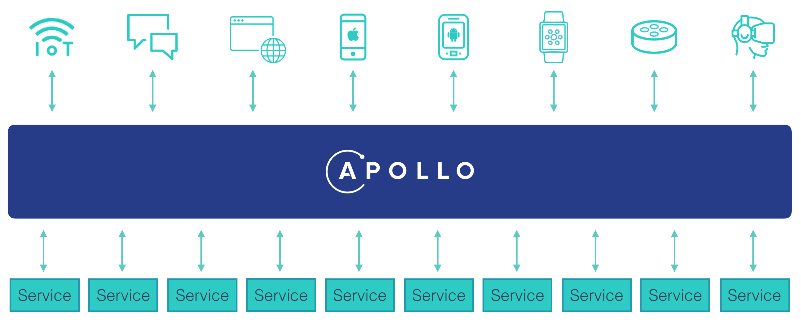
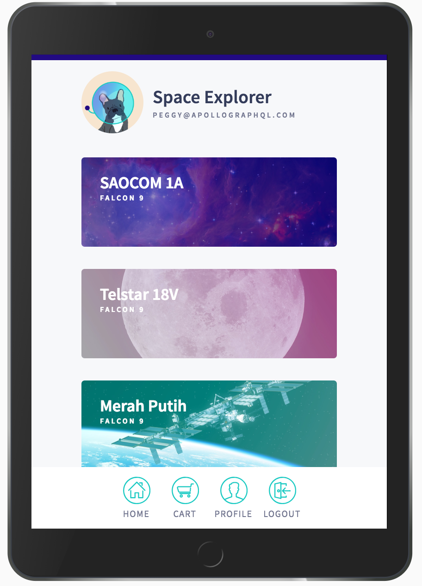

欢迎！很高兴你决定开始学习Apollo。本教程将会指导你使用Apollo平台开发第一个应用，包括编写一个graph API并将之连接到一个React前端应用上。

我们希望在完成教程之后你可以开发出生产环境可用的应用，所以我们没有使用常规的“Hello World”，而是采用了一个真实的例子，包括了真实环境中可能用到的各种功能，包括鉴权、分页、测试等。准备好了？Let's go！

## Apollo是什么？

Apollo是一个开发graph的平台。它包括两个运行时：**Apollo Server** and **Apollo Client**，分别用于提供和查询graph API。它也提供了一些开发者工具，可以方便地集成到你现有的工作流程中，提供性能和安全方面的可视化。

为什么你需要graph？现今，开发一个应用最困难的部分之一就是搞定数据层。很常见的情况是，你需要从很多数据源获取数据，同时你还要支持很多不同的客户端。当你在服务器和UI中间插入graph层之后，你可以降低数据获取的复杂性，同时加速新功能的发布。



**[GraphQL](https://www.graphql.org/)** 是我们用来在graph API和客户端之间通信的一个标准。它最特别的地方在于它是编程语言无关的且并不绑定具体实现，Apollo是标准的具体实现。

## 我们会开发出什么

在本教程中，我们将开发一个交互式的应用，为即将到来的Space-X火箭发射预定位置，你可以把它看做是太空旅行的爱彼迎（Airbnb）。所有的数据都是真实的，感谢[SpaceX-API](https://github.com/r-spacex/SpaceX-API)提供接口。

项目完成后看起来是这个样子：



这个应用有五个界面：登录、火箭班次、班次详情、用户设置和订单。Graph API让我们的太空旅行应用连接到一个REST API和一个SQLite数据库上。如果你对这两个技术不太熟悉，别担心，你不须要从头开发一个REST API或SQLite数据库。

我们希望能尽可能地模拟一个真实的应用，所以我们会覆盖必要的知识点包括：鉴权、分页、状态管理、测试和部署。

## 预备知识

本教程假设你熟悉JavaScript/ES6，熟悉如何使用API获取数据，有基本的React的使用经验。如果你须要提高React技能，推荐去[React官方教程](https://reactjs.org/tutorial/tutorial.html)。Apollo并不强制使用React来开发前端，然而React是最集成Apollo客户端最方便的框架。如果你使用其它的框架（如Angular或Vue），你可以自行把Apollo客户端的一些概念映射到相应的框架中。

### 系统要求

开始之前，确定你有以下软件：

- [Node.js](https://nodejs.org/) v8.x或更高版本
- [npm](https://www.npmjs.com/) v6.x或更高版本
- [git](https://git-scm.com/) v2.14.1或更高版本

虽然不是强制需求，推荐使用[VSCode](https://code.visualstudio.com/)作为编辑器，因为我们提供了一个很不错的VSCode插件。将来我们希望能支持更多的编辑器。

## 搭建开发环境

开始！先安装这些开发工具

- [Apollo Graph Manager (必需)](https://engine.apollographql.com) : 注册和管理graph API的云服务。（译者：其实并不是必需的）
- [Chrome的Apollo开发插件 (建议)](https://chrome.google.com/webstore/detail/apollo-client-developer-t/jdkknkkbebbapilgoeccciglkfbmbnfm) : Chrome插件，可以查看客户端的运行情况。
- [VSCode的Apollo插件 (建议)](https://marketplace.visualstudio.com/items?itemName=apollographql.vscode-apollo): 编辑器插件，提供自动补全、语法高亮等。

接下来在你的终端clone[这个仓库](https://github.com/apollographql/fullstack-tutorial)：

```bash
git clone https://github.com/apollographql/fullstack-tutorial/
```

里面有两个文件夹：开发的起始点`start`和最终版本`final`。在每个文件夹里又有两个子文件夹，一个是客户端`client`另一个是服务器端`server`，我们将从服务器端开始。如果你已经熟悉如何开发graph API，你可以从[教程的后半部分](jiao-cheng/lian-jie-api-dao-client/)开始。

### 从哪里获得帮助？

我们知道学习新技术有时候并不容易，碰到拦路虎很常见！如果你碰到困难，推荐加入[Apollo Spectrum社区](https://spectrum.chat/apollo)发帖提问。

鉴于译者水平，如果有任何疑问或发先错误，请先确认[英文原版文档](https://www.apollographql.com/docs/)，确认是原版文档问题或是翻译问题。如果是翻译问题，你可以点击右上角的“Edit on Github”来提交一个PR。
